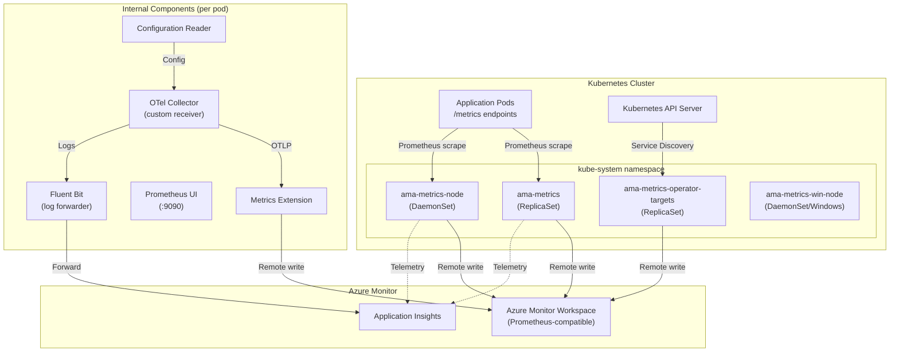

# AGENTS.md

## Setup Commands

```bash
# Prerequisites
# - Go 1.23+ (toolchain 1.23.8)
# - Docker (for container builds)
# - kubectl + Helm 3 (for deployment and E2E tests)
# - Node.js 18+ (for tools/az-prom-rules-converter)

# Clone and navigate
git clone git@github.com:ganga1980/prometheus-collector.git
cd prometheus-collector

# Build the OTel collector and all components
cd otelcollector/opentelemetry-collector-builder
make all

# Build the TypeScript rules converter
cd ../../tools/az-prom-rules-converter
npm install
npm run build

# For E2E tests, bootstrap a dev cluster following:
# otelcollector/test/README.md#bootstrap-a-dev-cluster-to-run-ginkgo-tests
```

## Code Style

### Go
- **Naming**: PascalCase for exported identifiers, camelCase for unexported
- **Imports**: Three-tier grouping — stdlib, external packages, internal/local modules
- **Error handling**: `fmt.Errorf("context: %w", err)` wrapping pattern; early returns on error
- **Logging**: Standard `log` package (`log.Println`, `log.Fatalf`); JSON logging for CCP mode via `shared.SetupCCPLogging()`
- **Config**: Environment variables with defaults via `shared.GetEnv("KEY", "default")`
- **Module structure**: Each component has its own `go.mod` with `replace` directives to local shared modules

### TypeScript
- **Strict mode**: `tsconfig.json` has `"strict": true`
- **Naming**: camelCase for variables/functions, PascalCase for types/interfaces
- **Error handling**: Result objects with `{success: boolean, error?: {title, details}}`

### Shell Scripts
- Use `#!/bin/bash`
- Prefer `tdnf` for package installation (Mariner Linux base)

## Testing Instructions

**Framework**: [Ginkgo v2](https://onsi.github.io/ginkgo/) (BDD-style Go testing) + [Gomega](https://onsi.github.io/gomega/) matchers

**Test locations**: `otelcollector/test/ginkgo-e2e/` with suites: `configprocessing`, `prometheusui`, `containerstatus`, `operator`, `livenessprobe`, `querymetrics`, `regionTests`

**Naming convention**: `*_test.go` with `suite_test.go` per package

**Run tests**:
```bash
# Run a specific Ginkgo E2E suite (requires bootstrapped K8s cluster)
cd otelcollector/test/ginkgo-e2e/configprocessing
go test -v ./...

# Run TypeScript tests
cd tools/az-prom-rules-converter
npm test
```

**Test utilities**: `otelcollector/test/utils/` provides K8s client setup, Azure Monitor query helpers, Prometheus API helpers, and shared constants.

**Labels**: Tests use Ginkgo labels (`Label(utils.ConfigProcessingCommon)`, `Label("operator")`, `Label("windows")`, `Label("arm64")`) for selective execution.

## Dev Environment Tips

- **Multiple Go modules**: This monorepo has 24 `go.mod` files. Your IDE may need workspace configuration — use Go workspaces or open specific module directories.
- **Local replace directives**: `otelcollector/go.mod` uses `replace` for `github.com/prometheus-collector/shared` → `./shared`. Run `go mod tidy` from the correct directory.
- **Docker builds**: Multi-stage, multi-arch. Use `docker buildx` for cross-platform builds.
- **Environment variables**: Key vars include `CLUSTER`, `AKSREGION`, `customEnvironment`, `MODE` (advanced/nodefault), `CONTROLLER_TYPE` (DaemonSet/ReplicaSet).
- **OTel version tracking**: Current versions are in `OPENTELEMETRY_VERSION` and `TARGETALLOCATOR_VERSION` files at repo root.

## Recommended AI Workflow

### Explore → Plan → Code → Commit
For complex, multi-file changes:
1. **Explore** — Ask the AI to read and explain relevant code: "Read `otelcollector/main/main.go` and explain the startup sequence."
2. **Plan** — Ask for a structured implementation plan: "Plan how to add a new Prometheus scrape config processor."
3. **Code** — Implement incrementally: "Implement step 1: add the config parser in `otelcollector/shared/`."
4. **Test** — Run tests: "Run `go test ./...` in the affected module."
5. **Commit** — Use Conventional Commits: `feat:`, `fix:`, `build(deps):`, `test:`, `docs:`.

### Validating AI-Generated Code
1. Run `go build` in the affected module directory.
2. Run `go test ./...` for unit tests.
3. Run `go vet ./...` for static analysis.
4. Check `go mod tidy` doesn't produce unexpected changes.
5. For container changes, rebuild and scan with Trivy.

## PR Instructions

- **Commit format**: Conventional Commits preferred — `feat:`, `fix:`, `build(deps):`, `test:`, `docs:`. PR titles should also follow this format.
- **Branch naming**: Feature branches from `main`.
- **PR template**: Fill all sections in `.github/pull_request_template.md`, especially the Tests Checklist.
- **Required for features**: Telemetry additions, one-pager link, scale/perf test results.
- **Required for all code changes**: Ginkgo E2E test results with relevant labels.
- **Merge strategy**: Squash merge (clean history).

## Architecture Diagram


