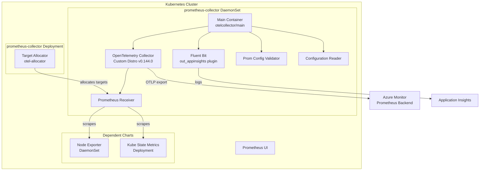

# AGENTS.md

## Setup Commands

```bash
# Clone the repo
git clone git@github.com:ganga1980/prometheus-collector.git
cd prometheus-collector

# Build the full collector (requires Go 1.24+, make, gcc)
cd otelcollector/opentelemetry-collector-builder
make all

# Build the TypeScript rules converter tool
cd ../../tools/az-prom-rules-converter
npm install
npm run build

# Build Prometheus mixins (requires go-jsonnet, jsonnet-bundler)
cd ../../mixins/kubernetes
jb install && make all
```

## Code Style

### Go
- **Import grouping**: stdlib → third-party → internal packages (e.g., `github.com/prometheus-collector/shared`)
- **Naming**: PascalCase for exported identifiers, camelCase for unexported
- **Package aliases**: Used for clarity, e.g., `shared "github.com/prometheus-collector/shared"`
- **Error handling**: `if err != nil { return err }` — always check and propagate errors
- **Logging**: `log.Println()`, `log.Fatalf()` from standard library
- **String comparison**: `strings.EqualFold()` for case-insensitive comparisons
- **Environment variables**: `os.Getenv()` for configuration
- **YAML parsing**: `gopkg.in/yaml.v2` (v2, not v3 in most modules)
- **License headers**: Apache-2.0 SPDX on OpenTelemetry-derived files
- **Generated code**: Marked with `// Code generated by mdatagen. DO NOT EDIT.`

### TypeScript
- **Module system**: ES6 imports (`import x from 'y'`)
- **Type annotations**: Function signatures and return types annotated
- **Async**: `async/await` pattern throughout
- **CLI framework**: Commander.js
- **Error handling**: Type-safe `StepResult` objects (not throw/catch)
- **Test framework**: Jest with `describe`/`test`/`expect`

### Shell Scripts
- Bash scripts for build automation and configuration parsing
- PowerShell scripts (`*.ps1`) for Windows-specific operations

## Testing Instructions

### Go Unit Tests
```bash
# Run tests for a specific module
cd otelcollector/prometheusreceiver
go test ./...
```

### TypeScript Tests
```bash
cd tools/az-prom-rules-converter
npm test
```

### Ginkgo E2E Tests
E2E tests require a live AKS cluster bootstrapped per `otelcollector/test/README.md`. Tests are organized by suite under `otelcollector/test/ginkgo-e2e/`:
- `operator/` — Operator CRD tests
- `querymetrics/` — Metric query validation
- `configprocessing/` — Configuration processing
- `livenessprobe/` — Health check tests
- `prometheusui/` — UI tests

Test labels: `operator`, `windows`, `arm64`, `arc-extension`, `fips`.

### Adding New Tests
1. Add test files following `*_test.go` naming in the appropriate module
2. For E2E: add scrape jobs to `otelcollector/test/test-cluster-yamls/`
3. Register new test labels in `otelcollector/test/utils/constants.go`
4. Add new test suites to `otelcollector/test/testkube/testkube-test-crs.yaml`

## Dev Environment Tips

- Use Go 1.24+ with the correct toolchain (see `go.mod` `toolchain` directive)
- The monorepo has 23+ `go.mod` files — use `cd` into the correct module before running `go` commands
- `otelcollector/go.mod` uses `replace` directives for local shared packages
- Docker is needed for full builds; individual Go components can be built standalone
- Version tracking files: `otelcollector/VERSION` (collector), `OPENTELEMETRY_VERSION`, `TARGETALLOCATOR_VERSION`

## PR Instructions

- **Commit format**: Conventional Commits — `feat:`, `fix:`, `test:`, `build:`, `docs:`, `ci/cd:`, `release:`
- **Branch naming**: Feature branches; PRs target `main`
- **PR template**: Follow `.github/pull_request_template.md` checklist
- **Required for features**: Telemetry documentation, one-pager link, scale/perf test results
- **Required for all code changes**: E2E Ginkgo test results with applicable labels
- **Merge strategy**: Squash merge with PR reference in commit message

## Architecture Diagram


