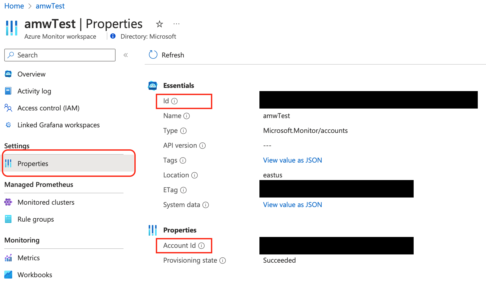
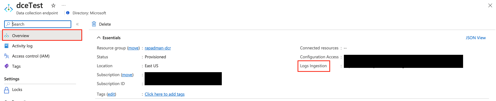
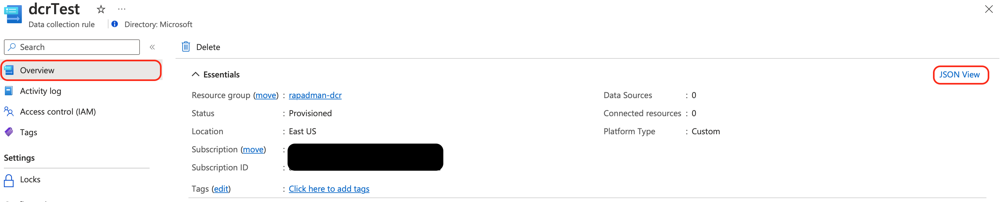
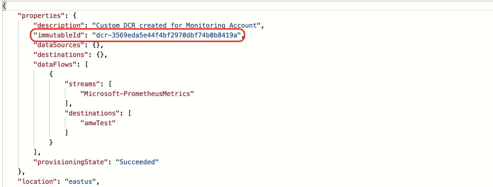

# Instructions on how to create custom Data collection endpoint(DCE) and custom Data collection rule(DCR) for an existing Azure monitor workspace(AMW) to ingest Prometheus metrics

## Step 1: Deploy Custom DCE

Update the CustomDCE.parameters.json with appropiate values.

You can deploy custom DCE template by running the following command:

```az deployment group create -g <resource_group> -n <deployment_name> --template-file CustomDcrAndDceArmTemplates/CustomDCE.json --parameters CustomDcrAndDceArmTemplates/CustomDCE.parameters.json```

## Step 2: Deploy Custom DCR

Update the CustomDCR.parameters.json with appropiate values. You can find the values for Azure Monitor Workspace Resource ID and Account ID from the Properites tab of the Azure Monitor Workspace to which you would like to ingest.




You can deploy custom DCR template by running the following command:

```az deployment group create -g <resource_group> -n <deployment_name> --template-file CustomDcrAndDceArmTemplates/CustomDCR.json --parameters CustomDcrAndDceArmTemplates/CustomDCR.parameters.json```

## Step 3: Constructing Ingestion URL for Azure Monitor remote write sidecar

Ingestion URL format:
```<CustomDCE>/dataCollectionRules/<DCRImmutableId>/streams/Microsoft-PrometheusMetrics/api/v1/write?api-version=2021-11-01-preview```

CustomDCE - This can be obtained from the overview page of the Custom DCE created in Step 1.



> [!NOTE]
> The endpoint obtained from the overview page is the Logs ingestion endpoint. As we are trying to ingest Prometheus metrics, we can update this endpoint to metrics endpoint by adding ".metrics" to the endpoint in the following way
>
> Log ingestion endpoint: https://sample-kqr2.eastus-1.ingest.monitor.azure.com/
> 
> Metrics ingestion endpoint: https://sample-kqrs.eastus-1.metrics.ingest.monitor.azure.com/

DCRImmutableId - This can be obtained from the JSON view of the DCR






