# Demo diagrams: the AKS `kube-system` lockdown story

> **This is the demo doc — drive the talk straight from here.** Each diagram has a one-line **`Say:`** cue beneath it: that's your talk-track. Walk top to bottom (0 → 9) and talk over each picture; don't read the cue verbatim. All diagrams are **Mermaid** (render on GitHub / VS Code / most markdown viewers).
>
> `aks-vap-demo-script.md` is optional backup only — deeper wording, the verbatim error message, and the Q&A appendix if someone digs in. You don't need it open during the demo.
>
> **Order (built for an audience new to ama-metrics):**
> 0 (what is ama-metrics) → 1 (the project) → 2 (why it's a mountain) → 3 (the story spine) → 4 (reframe) → 5 (money diagram) → 6 (fix) → 7 (reproduce) → 8 (validation) → 9 (lessons).
>
> **Color legend (consistent across every diagram):** blue = context/input · yellow = investigation/decision · green = success · red = deny/break · orange = the policy itself.

---

## 0. What is ama-metrics? (set the stage)

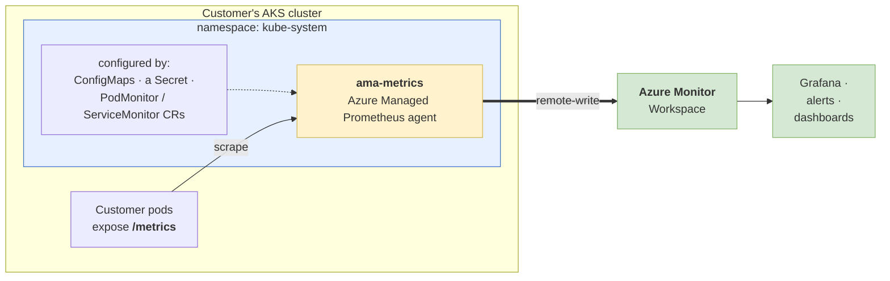

> **Say:** "Before the story makes sense, one thing about ama-metrics: it's Azure's *managed* Prometheus agent — we run it for the customer, inside their AKS cluster, in the `kube-system` namespace. Its job is simple: scrape the `/metrics` endpoints on their pods and remote-write everything to an Azure Monitor Workspace, which feeds Grafana, alerts, and dashboards. The important part for today is *how customers configure it*: they hand us ConfigMaps, one Secret, and a couple of custom resources — PodMonitors and ServiceMonitors. And every bit of that config lives in `kube-system`, right next to the agent. Hold onto that fact — it's the whole reason this problem is hard."

---

## 1. The project — as it was handed to me

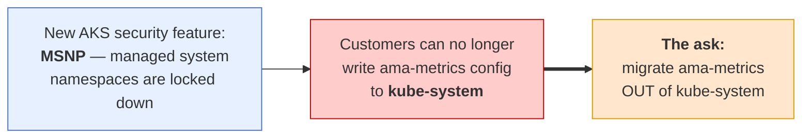

> **Say:** "AKS shipped a lockdown on system namespaces. Overnight, customers couldn't apply ama-metrics config to `kube-system`. The project landed on my desk as a *solution*: **move ama-metrics to a different namespace.** Sounds reasonable — until you look at what that actually costs."

---

## 2. Why "just migrate it" is a mountain

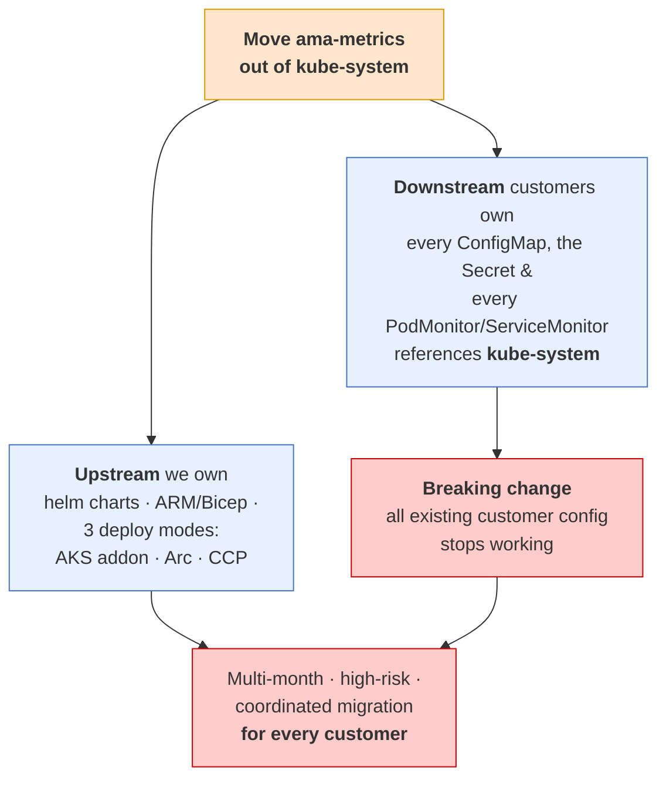

> **Say:** "It touches everything we ship — three deploy modes, helm, ARM. Worse, it's a **breaking change for customers**: every ConfigMap, Secret, and CR they've ever written points at `kube-system`. Migrating the agent means migrating *all of them*. That's a multi-month, high-risk fire drill. So before building any of it, I stopped and asked one question."

---

## 3. The story spine — how I approached it

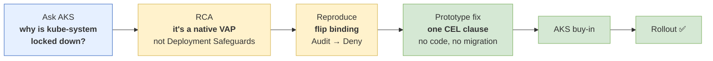

> **Say:** "Six steps. The whole thing turned on step 2 — finding the *actual* mechanism — which made steps 3–6 cheap. Instead of a quarter of migration, it became a month."

---

## 4. The reframe — solution vs problem

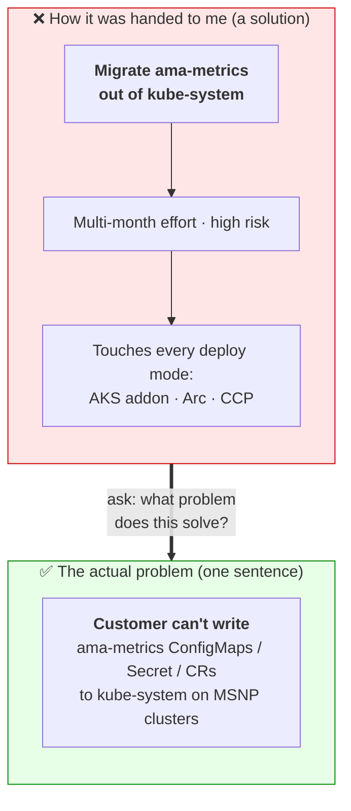

> **Say:** "'Migrate the addon' *felt* like the problem. It was a solution in disguise. The real problem is one sentence — and it has cheaper answers."

---

## 5. The money diagram — WHERE the block happens

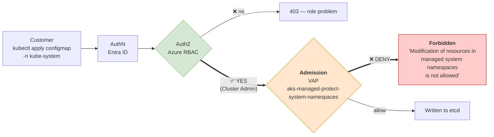

> **Say:** "This one diagram is the whole insight, so let me slow down. When a customer runs `kubectl apply`, the request goes through two gates. First **authentication** — who are you — then **authorization**, Azure RBAC — are you allowed. And here's the twist: **RBAC says YES.** The customer is Cluster Admin; by every permission check, they're allowed to write this ConfigMap. But there's a *third* gate they don't see — **admission** — and that's where a Validating Admission Policy steps in and says *no, not in a protected namespace*. Because the deny lives at admission, **not** authorization, there is no Azure role — not even a hand-crafted custom one — that can grant your way past it. That's the key realization: the fix cannot be a permissions change. It has to live in the policy itself. And that completely changes what the right solution is."

---

## 6. The fix — VAP decision tree, before vs after

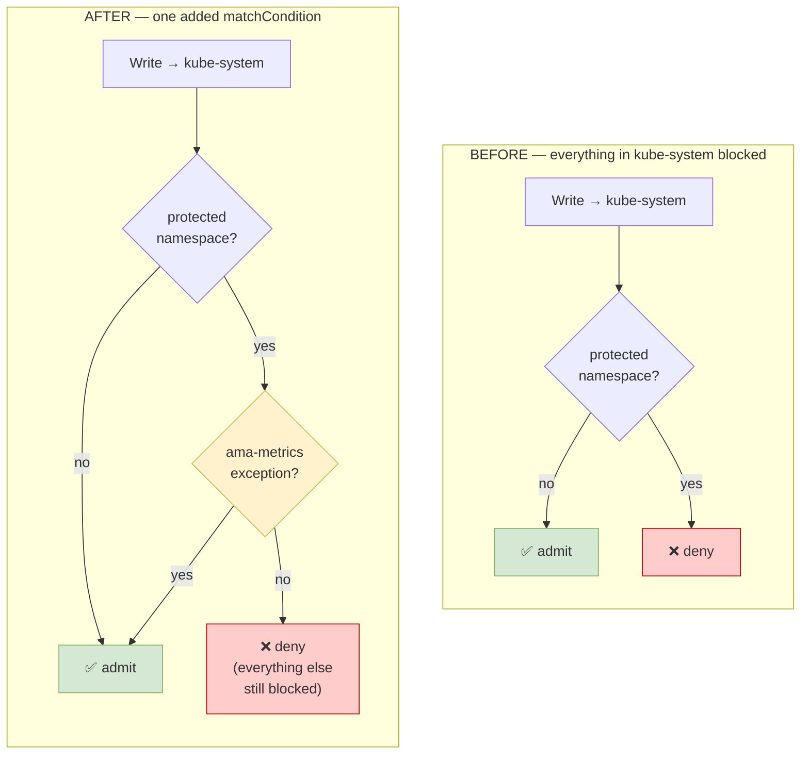

**The exception (one CEL clause) exempts only these:**

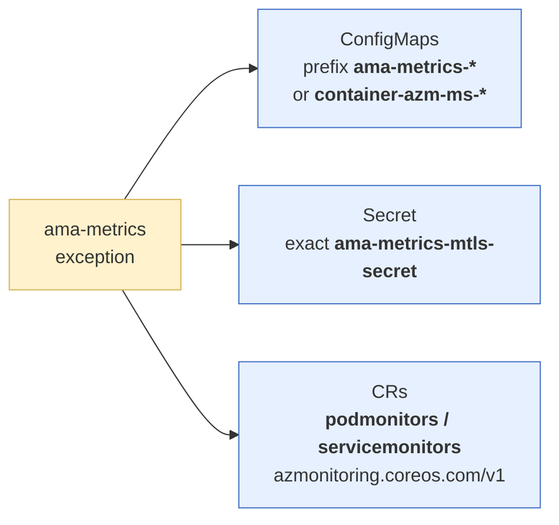

> **Say:** "The fix is one negated clause: *if it's one of these specific objects, short-circuit and admit.* Zero code change in ama-metrics. Nothing moves namespaces."

---

## 7. How I reproduced it safely (the PoC lever)

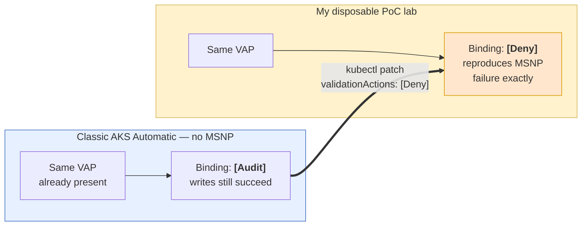

> **Say:** "The same policy ships on classic AKS Automatic in *Audit* mode. Flip one field to *Deny* and I've got a safe lab that behaves exactly like a real MSNP customer — no need to touch production."

---

## 8. Validation of what AKS shipped

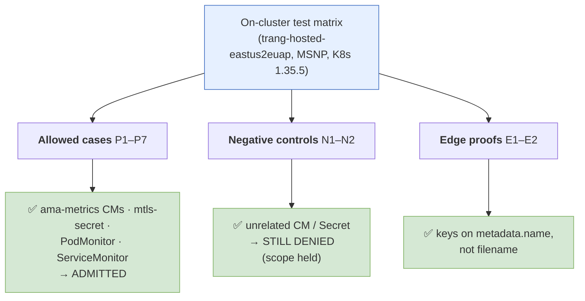

> **Say:** "Every allowed object goes through; every unrelated object is still blocked. The exception is *scoped*, not a hole. AKS is rolling this out now."

---

## 9. Lessons — what I'd want you to take away

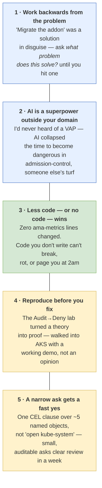

> **Say:** "If you forget everything else: the cheapest fix we ever ship is the one we talk ourselves out of building. RCA first, reproduce to prove it, then make the ask small enough that the answer is yes."

---

## Appendix — quick render tips

- **GitHub / VS Code**: renders inline automatically. In VS Code use the built-in Markdown preview (`Ctrl+Shift+V`).
- **Export to image** (for a slide, if ever needed): paste a block into <https://mermaid.live> → export SVG/PNG.
- **Colors** use the classic Mermaid palette (blue = context/input, yellow = investigation/decision, green = success, red = deny/break, orange = the policy) — consistent across all ten diagrams so the audience learns the legend once.
