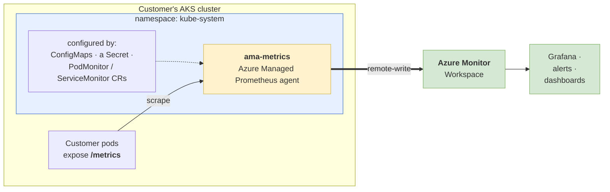
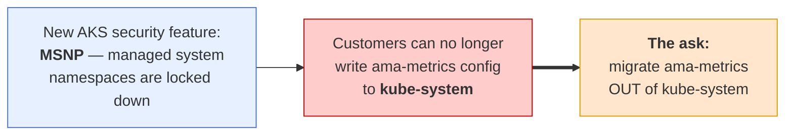
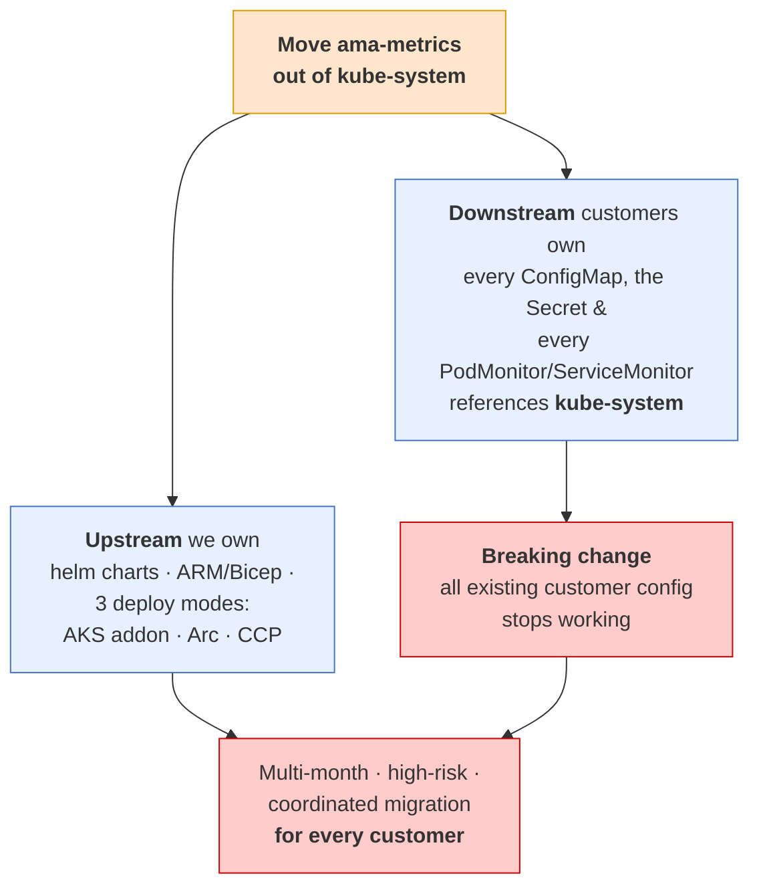
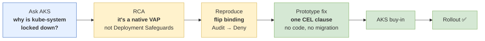
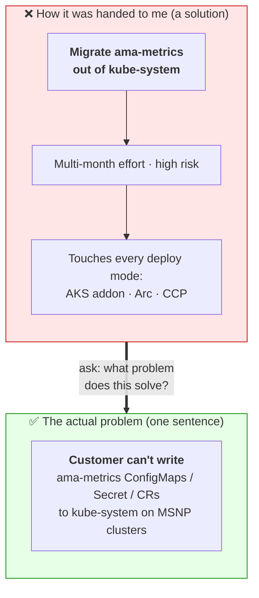
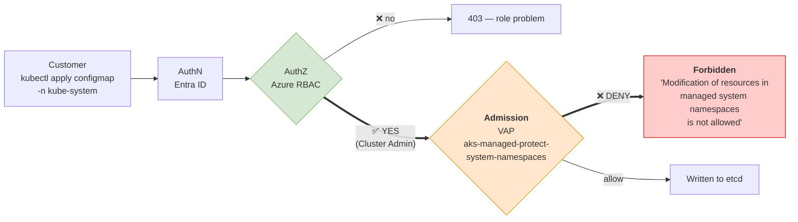
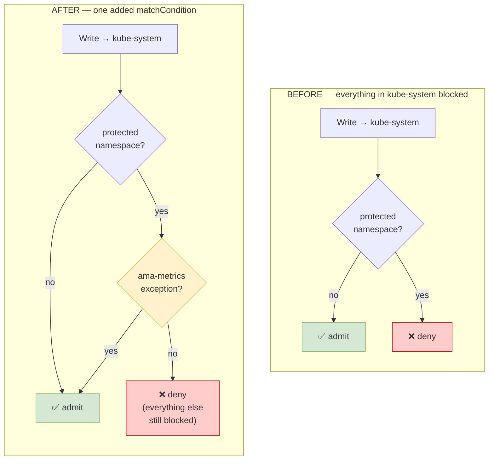
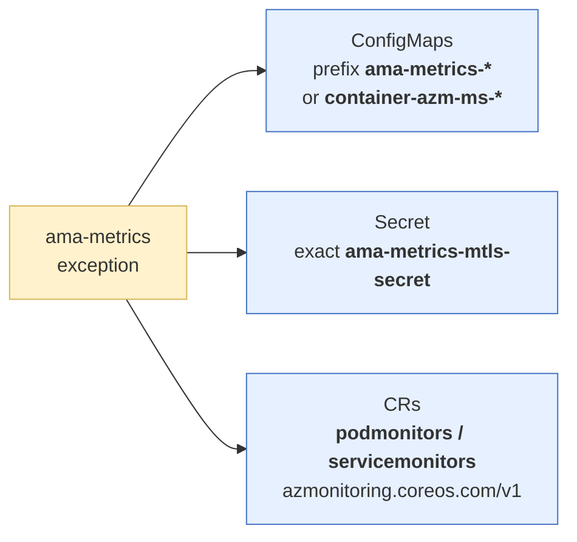
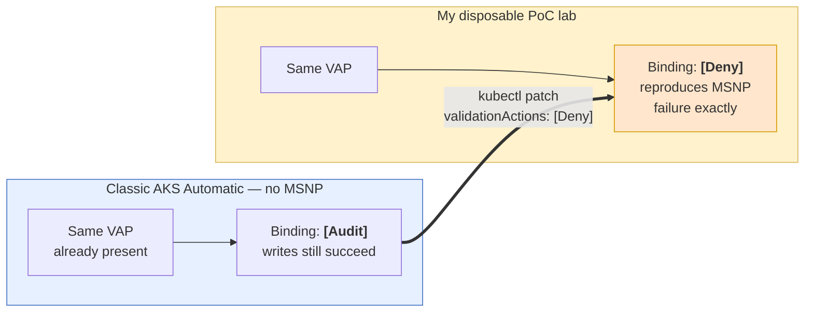
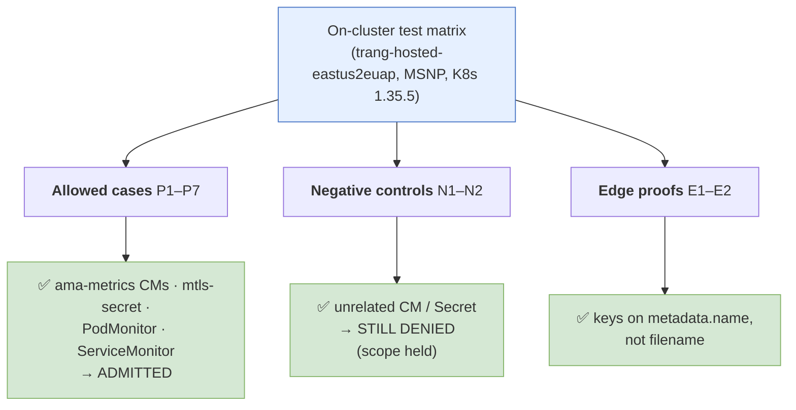

# Demo diagrams: the AKS `kube-system` lockdown story

> Visual companion to `aks-vap-demo-script.md`. All diagrams are **Mermaid** (render on GitHub / VS Code / most markdown viewers). One line of speaker cue under each — talk over the picture, don't read it.
>
> **Suggested order (built for an audience new to ama-metrics):**
> 0 (what is ama-metrics) → 1 (the project) → 2 (why it's a mountain) → 3 (the story spine) → 4 (reframe) → 5 (money diagram) → 6 (fix) → 7 (reproduce) → 8 (validation).
>
> **Color legend (consistent across every diagram):** blue = context/input · yellow = investigation/decision · green = success · red = deny/break · orange = the policy itself.

---

## 0. What is ama-metrics? (set the stage)

> **Say:** "ama-metrics is Azure's managed Prometheus agent. It runs *inside* the customer's cluster — in `kube-system` — scrapes their pods, and ships metrics to an Azure Monitor Workspace. Customers steer it with ConfigMaps, a Secret, and a couple of custom resources. Remember that last part: **all of that config lives in `kube-system`.**"

---

## 1. The project — as it was handed to me

> **Say:** "AKS shipped a lockdown on system namespaces. Overnight, customers couldn't apply ama-metrics config to `kube-system`. The project landed on my desk as a *solution*: **move ama-metrics to a different namespace.** Sounds reasonable — until you look at what that actually costs."

---

## 2. Why "just migrate it" is a mountain

> **Say:** "It touches everything we ship — three deploy modes, helm, ARM. Worse, it's a **breaking change for customers**: every ConfigMap, Secret, and CR they've ever written points at `kube-system`. Migrating the agent means migrating *all of them*. That's a multi-month, high-risk fire drill. So before building any of it, I stopped and asked one question."

---

## 3. The story spine — how I approached it

> **Say:** "Six steps. The whole thing turned on step 2 — finding the *actual* mechanism — which made steps 3–6 cheap. Instead of a quarter of migration, it became a month."

---

## 4. The reframe — solution vs problem

> **Say:** "'Migrate the addon' *felt* like the problem. It was a solution in disguise. The real problem is one sentence — and it has cheaper answers."

---

## 5. The money diagram — WHERE the block happens

> **Say:** "This is the whole insight. **RBAC says YES.** The deny happens *later*, at admission. So no Azure role — not even a custom one — can bypass it. The fix has to live in the policy."

---

## 6. The fix — VAP decision tree, before vs after

**The exception (one CEL clause) exempts only these:**

> **Say:** "The fix is one negated clause: *if it's one of these specific objects, short-circuit and admit.* Zero code change in ama-metrics. Nothing moves namespaces."

---

## 7. How I reproduced it safely (the PoC lever)

> **Say:** "The same policy ships on classic AKS Automatic in *Audit* mode. Flip one field to *Deny* and I've got a safe lab that behaves exactly like a real MSNP customer — no need to touch production."

---

## 8. Validation of what AKS shipped

> **Say:** "Every allowed object goes through; every unrelated object is still blocked. The exception is *scoped*, not a hole. AKS is rolling this out now."

---

## Appendix — quick render tips

- **GitHub / VS Code**: renders inline automatically. In VS Code use the built-in Markdown preview (`Ctrl+Shift+V`).
- **Export to image** (for a slide, if ever needed): paste a block into <https://mermaid.live> → export SVG/PNG.
- **Colors** use the classic Mermaid palette (blue = context/input, yellow = investigation/decision, green = success, red = deny/break, orange = the policy) — consistent across all nine diagrams so the audience learns the legend once.
