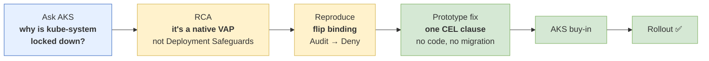
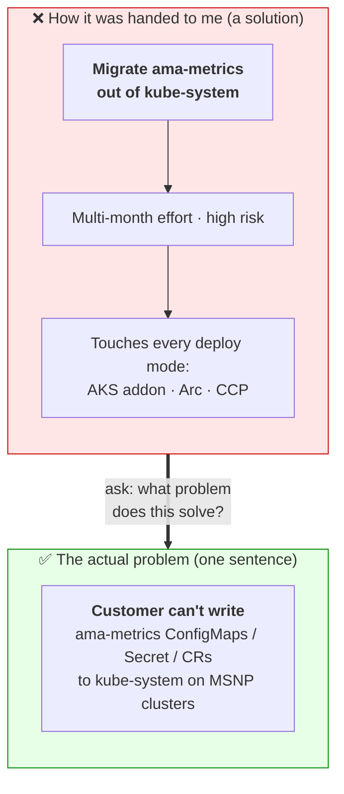
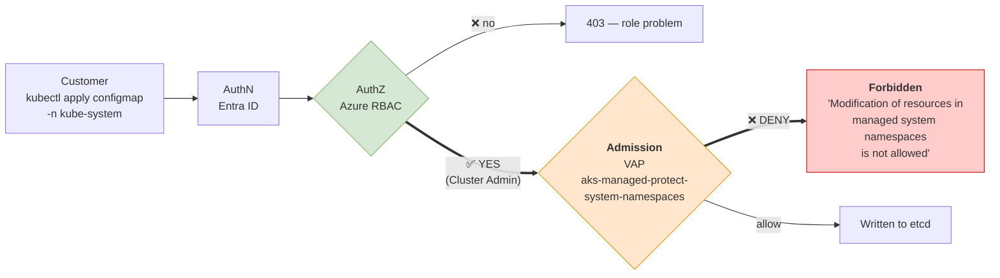
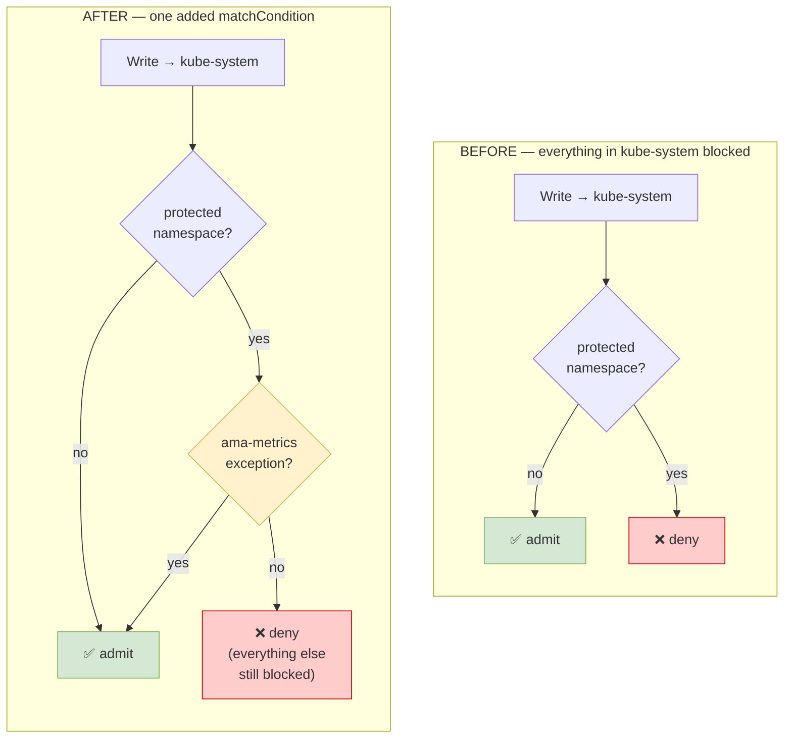
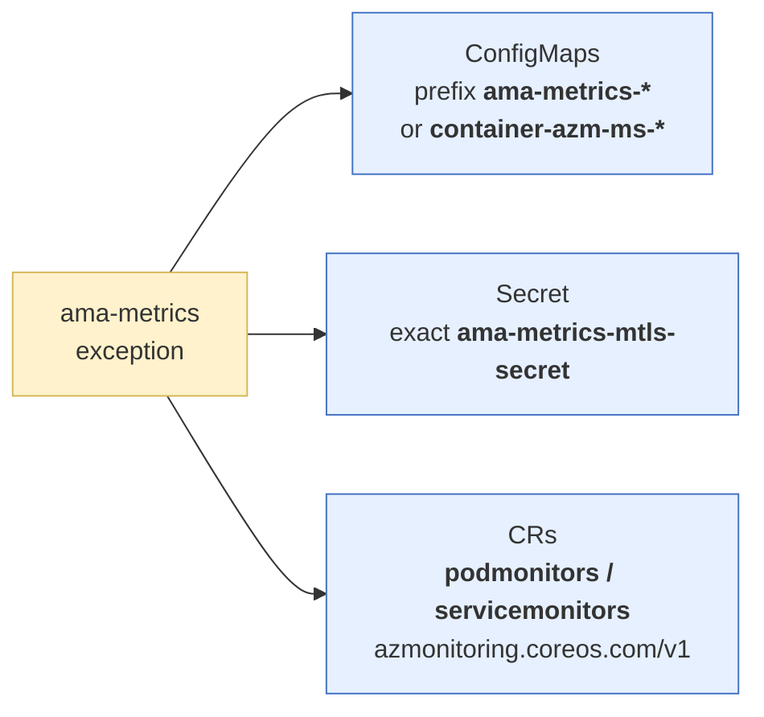
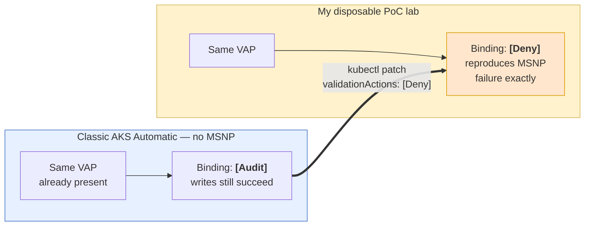
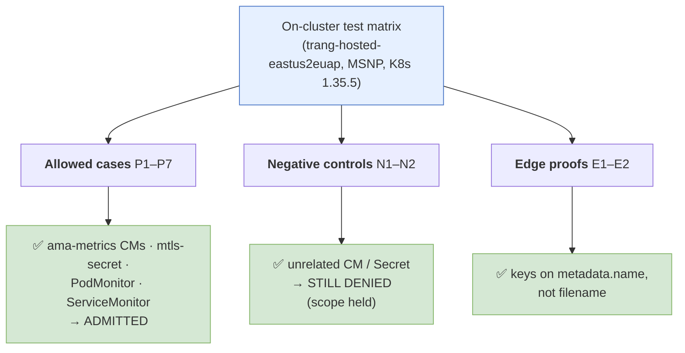

# Demo diagrams: the AKS `kube-system` lockdown story

> Visual companion to `aks-vap-demo-script.md`. All diagrams are **Mermaid** (render on GitHub / VS Code / most markdown viewers). One line of speaker cue under each — talk over the picture, don't read it.
>
> **Suggested order:** 1 (spine) → 2 (reframe) → 3 (money diagram) → 4 (fix) → 5 (reproduce) → 6 (results).

---

## 1. The story spine — how I approached it

> **Say:** "Six steps. The whole thing turned on step 2 — finding the *actual* mechanism — which made steps 3–6 cheap."

---

## 2. The reframe — solution vs problem

> **Say:** "'Migrate the addon' *felt* like the problem. It was a solution in disguise. The real problem is one sentence — and it has cheaper answers."

---

## 3. The money diagram — WHERE the block happens

> **Say:** "This is the whole insight. **RBAC says YES.** The deny happens *later*, at admission. So no Azure role — not even a custom one — can bypass it. The fix has to live in the policy."

---

## 4. The fix — VAP decision tree, before vs after

**The exception (one CEL clause) exempts only these:**

> **Say:** "The fix is one negated clause: *if it's one of these specific objects, short-circuit and admit.* Zero code change in ama-metrics. Nothing moves namespaces."

---

## 5. How I reproduced it safely (the PoC lever)

> **Say:** "The same policy ships on classic AKS Automatic in *Audit* mode. Flip one field to *Deny* and I've got a safe lab that behaves exactly like a real MSNP customer — no need to touch production."

---

## 6. Validation of what AKS shipped

> **Say:** "Every allowed object goes through; every unrelated object is still blocked. The exception is *scoped*, not a hole. AKS is rolling this out now."

---

## Appendix — quick render tips

- **GitHub / VS Code**: renders inline automatically. In VS Code use the built-in Markdown preview (`Ctrl+Shift+V`).
- **Export to image** (for a slide, if ever needed): paste a block into <https://mermaid.live> → export SVG/PNG.
- **Colors** use the classic Mermaid palette (blue = input/context, yellow = investigation/decision, green = success, red = deny) — consistent across all six diagrams so the audience learns the legend once.
