# Demo diagrams: the AKS `kube-system` lockdown story

> **This is the demo doc — drive the talk straight from here.** Each diagram has a one-line **`Say:`** cue beneath it: that's your talk-track. Walk top to bottom (0 → 7) and talk over each picture; don't read the cue verbatim. All diagrams are **Mermaid** (render on GitHub / VS Code / most markdown viewers).
>
> `aks-vap-demo-script.md` is optional backup only — deeper wording, the verbatim error message, and the Q&A appendix if someone digs in. You don't need it open during the demo.
>
> **Order (built for an audience new to ama-metrics):**
> 0 (what is ama-metrics) → 1 (the project) → 2 (why it's a mountain) → 3 (the story spine) → 4 (RCA — proving it's the VAP) → 5 (fix) → 6 (validation) → 7 (lessons).
>
> **Color legend (consistent across every diagram):** blue = context/input · yellow = investigation/decision · green = success · red = deny/break · orange = the policy itself.

---

## 0. What is ama-metrics? (set the stage)

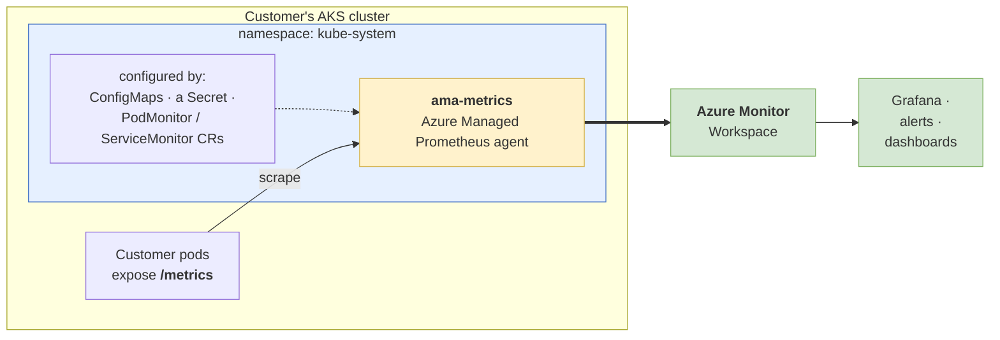

> **Say:** "Before the story makes sense, one thing about ama-metrics: it's Azure's *managed* Prometheus agent — we run it for the customer, inside their AKS cluster, in the `kube-system` namespace. Its job: scrape the `/metrics` endpoints on their pods and send everything to an Azure Monitor Workspace, which feeds Grafana, alerts, and dashboards. The important part for today is *how customers configure it*: they can deploy their ConfigMaps in kube-system, secrets, and a couple of custom resources — PodMonitors and ServiceMonitors. And Configmaps must lives in `kube-system`, right next to the agent. Hold onto that fact — it's one of the most important reasons that this project was initiated."

---

## 1. The project — as it was handed to me

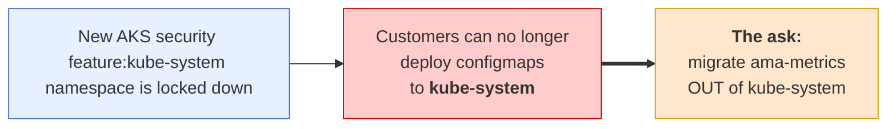

> **Say:** "AKS shipped a lockdown on system namespaces; customers couldn't apply ama-metrics used configmaps to `kube-system`. The project landed on my desk as a *solution*: **move ama-metrics to a different namespace.**"

---

## 2. Why "just migrate it" is a mountain

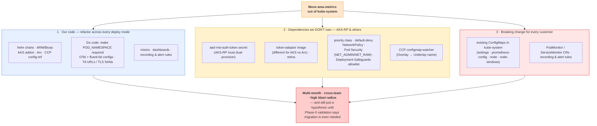

> **Say:** "Migration isn't one change — it's three problems stacked. **One:** we refactor our own code across every deploy mode — helm, ARM, Go, the OTel and fluent-bit configs, plus dashboards and recording/alert rules that filter on the agent's namespace. **Two:** a pile of things we *don't* own — the `aad-msi-auth-token` secret AKS-RP provisions, the token-adaptor image (which differs between AKS and Arc), retina, priority classes, network policy, pod-security capabilities, the CCP config watcher — every one needs another team to move in lockstep. **Three:** it's a breaking change for *every* customer — all their existing ConfigMaps, CRs, and rules point at `kube-system`. Multi-month, cross-team, high blast radius. And the kicker: migration was still only a *hypothesis* — nobody had confirmed we even needed it. So before building any of it, I stopped and asked one question."

---

## 3. The story spine — how I approached it

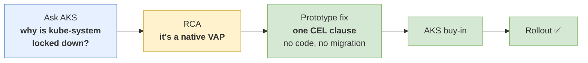

> **Say:** "The whole thing turned on step 2 — finding the *actual* mechanism — which made the rest cheap. Instead of a quarter of migration, it became a month."

---

## 4. RCA — how I proved it was the VAP

**Part 1 — the error names the culprit.** On an MSNP AKS Automatic cluster, applying an ama-metrics ConfigMap to `kube-system` fails — and the error body itself points the finger:

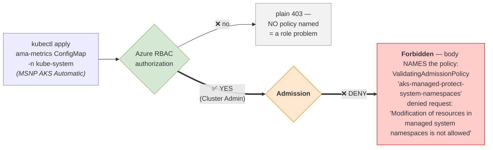

> **Say (Part 1):** "Read the failure. It's a 403 Forbidden — but look at the body: it literally names a `ValidatingAdmissionPolicy`, `aks-managed-protect-system-namespaces`. That's the fingerprint. A *role* denial — an RBAC 403 — never mentions a policy. So authorization actually **passed** — the customer is Cluster Admin — and the block happens one gate later, at **admission**. That already tells me two things: it's a VAP, and no Azure role can ever bypass it."

**Part 2 — confirm it by flipping the switch.** The same VAP ships on *classic* AKS Automatic, but in `[Audit]` mode (writes still succeed). On a cluster I could modify, I flipped one field and the failure reproduced exactly:

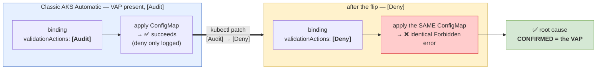

> **Say (Part 2):** "Then I confirmed it. That policy is present on *every* AKS Automatic cluster — on classic ones it just runs in Audit mode, so writes succeed and the deny is only logged. On a cluster I controlled, I changed one field on the binding, `Audit` to `Deny`, and re-applied the *exact same* ConfigMap. The identical error came back. Nothing else changed — so the VAP, and only the VAP, is the root cause. That's the proof I walked into AKS with."

---

## 5. The fix — one exempt clause, proven on the same cluster

Still on that classic AKS Automatic cluster (binding already flipped to `[Deny]` from the RCA step), I appended **one** `matchCondition` to the VAP — a negated CEL clause that exempts the ama-metrics ConfigMaps — then re-applied the exact ConfigMap that had just failed:

```yaml
# appended to spec.matchConditions[] of aks-managed-protect-system-namespaces
- name: exempt-ama-metrics-configmaps
  expression: |
    !(request.namespace == "kube-system" &&
      request.resource.resource == "configmaps" &&
      request.name in ["ama-metrics-prometheus-config",
                       "ama-metrics-settings-configmap",
                       "ama-metrics-prometheus-config-node",
                       "ama-metrics-prometheus-config-node-windows"])
```

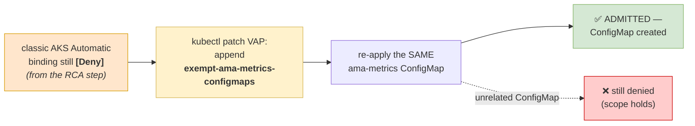

> **Say:** "Same cluster, still in Deny mode from a minute ago. I appended one `matchCondition` — this negated clause that says *if it's one of these named ama-metrics ConfigMaps in `kube-system`, skip the policy and admit.* Then I re-applied the **exact same** ConfigMap that had just been rejected — and it went straight through. Everything else in `kube-system` stayed blocked. That's the entire fix: no ama-metrics code changed, nothing moves namespaces, one CEL clause."

**How the clause works** — it just adds one branch to the policy's decision:

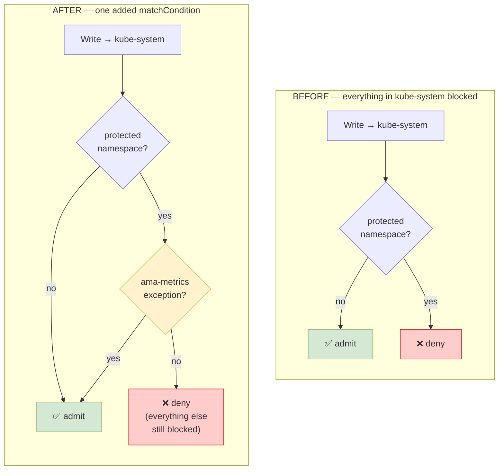

**From PoC to what AKS shipped** — AKS generalized my 4-name PoC into the final exception, covering all three object types ama-metrics is forced to put in `kube-system`:

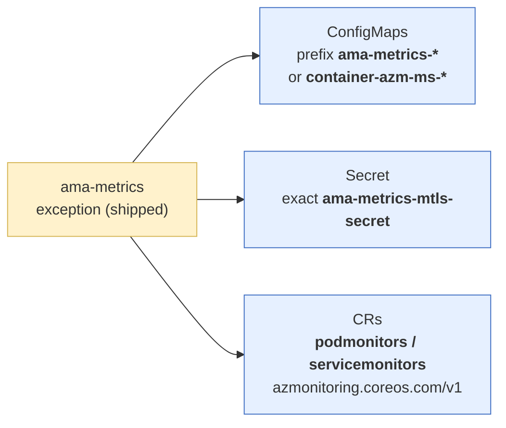

> **Say:** "My PoC exempted four named ConfigMaps. AKS took that same idiom and generalized it — a prefix match for the ConfigMaps so it covers ama-logs and future ones too, plus the mTLS Secret by exact name, plus the PodMonitor and ServiceMonitor CRs. Same one-clause shape, just the complete list of what's structurally pinned to `kube-system`."

---

## 6. Validation of what AKS shipped

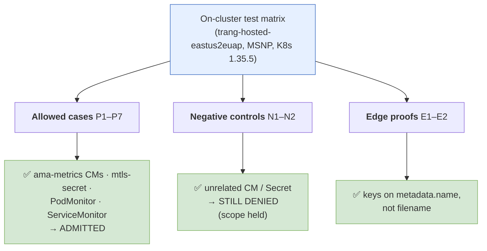

> **Say:** "Every allowed object goes through; every unrelated object is still blocked. The exception is *scoped*, not a hole. AKS is rolling this out now."

---

## 7. Lessons — what I'd want you to take away

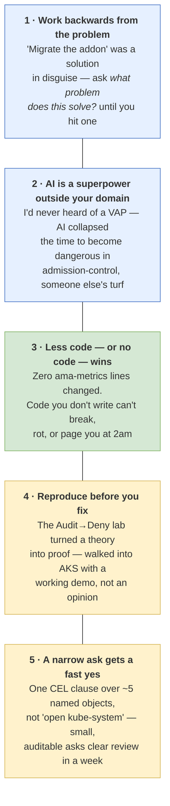

> **Say:** "If you forget everything else: the cheapest fix we ever ship is the one we talk ourselves out of building. RCA first, reproduce to prove it, then make the ask small enough that the answer is yes."

---

## Appendix — quick render tips

- **GitHub / VS Code**: renders inline automatically. In VS Code use the built-in Markdown preview (`Ctrl+Shift+V`).
- **Export to image** (for a slide, if ever needed): paste a block into <https://mermaid.live> → export SVG/PNG.
- **Colors** use the classic Mermaid palette (blue = context/input, yellow = investigation/decision, green = success, red = deny/break, orange = the policy) — consistent across all diagrams so the audience learns the legend once.
